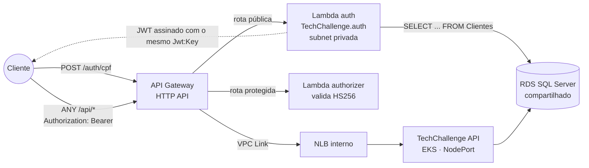
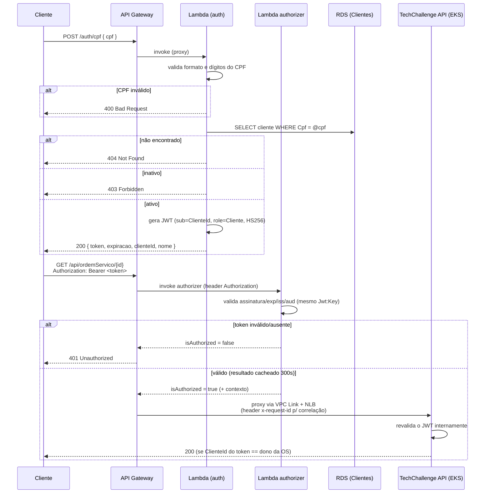

# TechChallenge Auth

## Descrição
Function Serverless (AWS Lambda) responsável pela autenticação de **clientes** da oficina via CPF. Recebe um CPF, valida o formato/dígitos verificadores, consulta a existência e o status (ativo/inativo) do cliente na mesma base de dados usada pela [TechChallenge API](https://github.com/TechChallenge01/TechChallenge), e devolve um token JWT válido para consumo das rotas protegidas daquela API.

Este repositório é um dos quatro que compõem o Tech Challenge:

| Repositório | Papel |
|---|---|
| [TechChallenge](https://github.com/TechChallenge01/TechChallenge) | Aplicação principal (API em Kubernetes) |
| **TechChallenge.auth** (este) | Function Serverless de autenticação por CPF |
| [TechChallenge.db](https://github.com/TechChallenge01/TechChallenge.db) | Infraestrutura do banco de dados gerenciado (Terraform) |
| [TechChallenge.k8s](https://github.com/TechChallenge01/TechChallenge.k8s) | Infraestrutura do cluster Kubernetes (Terraform) |

## Por que este desenho
A TechChallenge API já expõe rotas protegidas por perfil (`Administrador`, `Funcionario`, `Mecanico`, `Almoxarifado`, `Cliente`) validadas com JWT. O que faltava era um jeito do **cliente final** (dono do veículo) se autenticar sem senha — usando apenas o CPF já cadastrado — para consultar e aprovar suas próprias ordens de serviço. Extrair isso para uma function serverless, atrás de um API Gateway, evita subir mais um serviço "sempre ligado" no cluster só para um fluxo de baixíssimo volume/latência tolerante, e é exatamente o padrão pedido pelo desafio (Auth API Gateway + Function Serverless).

O token emitido aqui usa **a mesma chave de assinatura, issuer e audience** (`Jwt:Key` / `Jwt:Issuer` / `Jwt:Audience`) configurados na TechChallenge API — os dois serviços só compartilham um segredo, não código ou banco de escrita.

Este repositório também provisiona o **API Gateway como porta única de entrada de todo o sistema**:

| Rota no gateway | Destino | Proteção |
|---|---|---|
| `POST /auth/cpf`, `GET /health` | Lambda de auth | pública (é onde o token é emitido) |
| `ANY /api/{proxy+}` | TechChallenge API no EKS (via **VPC Link** → NLB interno) | **Lambda authorizer** valida o `Bearer` JWT (HS256) antes de encaminhar |

O *JWT authorizer* nativo do API Gateway v2 só valida tokens assimétricos (RS256/JWKS). Como o token do projeto é **HS256** (chave simétrica compartilhada), a validação no gateway é feita por um **Lambda authorizer** próprio (`terraform/src-authorizer/`, Node 20, sem dependências), com cache de 300s. A API principal continua validando o token internamente — o authorizer é uma segunda barreira na borda, não a substitui.

## Tecnologias utilizadas
- .NET 8 (ASP.NET Core Minimal APIs)
- `Amazon.Lambda.AspNetCoreServer.Hosting` — permite rodar o mesmo `Program.cs` localmente (Kestrel) e dentro da Lambda (Runtime API), sem duplicar código
- Entity Framework Core (SQL Server) — leitura da tabela `Clientes`
- `System.IdentityModel.Tokens.Jwt` — emissão do JWT
- Datadog — via **Log Forwarder** (CloudWatch → Datadog); a Lambda em si não é instrumentada em processo (subnet privada sem NAT)
- Docker (imagem de container, runtime `public.ecr.aws/lambda/dotnet:8`)
- Terraform — provisiona ECR, a Lambda de auth (em VPC), o Lambda authorizer, o API Gateway (HTTP API), o VPC Link e o NLB interno na frente do EKS
- GitHub Actions — CI (build + validação do Dockerfile/Terraform) e CD (build/push da imagem + `terraform apply`)

## Arquitetura



### Fluxo de autenticação e consumo de rota protegida



## Endpoint

**Base URL:** saída `api_base_url` do Terraform (ex.: `https://abc123.execute-api.us-east-1.amazonaws.com/`)

| Método | Rota | Descrição | Auth | Status |
|---|---|---|---|---|
| POST | `/auth/cpf` | Autentica um cliente pelo CPF e devolve um JWT | pública | 200, 400, 403, 404 |
| GET | `/health` | Healthcheck da Lambda de auth | pública | 200 |
| ANY | `/api/{proxy+}` | Encaminha para a TechChallenge API no EKS | `Authorization: Bearer <jwt>` (Lambda authorizer) | 401 se o token faltar/for inválido; senão o status da API |

**Request:**
```json
POST /auth/cpf
{
  "cpf": "52998224725"
}
```

**Response (200):**
```json
{
  "token": "eyJhbGciOiJIUzI1NiIsInR5cCI6IkpXVCJ9...",
  "expiracao": "2026-09-09T09:53:39Z",
  "clienteId": "22222222-0000-0000-0000-000000000001",
  "nome": "João Pereira"
}
```
(`52998224725` é um dos CPFs criados pelo seeder da TechChallenge API — ver `src/Infra/DbInitializer/DbSeeds.cs` naquele repo.)

**Erros:**
- `400` — CPF com formato ou dígitos verificadores inválidos
- `404` — nenhum cliente cadastrado com esse CPF
- `403` — cliente encontrado, porém inativo

Com a aplicação rodando localmente, o Swagger fica disponível em `http://localhost:5082/swagger`. Uma collection do Postman pode ser gerada importando esse mesmo `swagger.json`; os exemplos acima cobrem o único endpoint de negócio exposto.

## Como executar localmente

Pré-requisitos: .NET 8 SDK e acesso ao mesmo SQL Server usado pela TechChallenge API (o `docker-compose.yml` daquele repositório sobe um localmente).

```bash
git clone https://github.com/TechChallenge01/TechChallenger.auth.git
cd TechChallenger.auth/TechChallenger.auth

dotnet restore
dotnet run
```

A aplicação sobe em `http://localhost:5082`, com as mesmas configurações de banco/JWT do `appsettings.Development.json`. Ajuste `ConnectionStrings:DefaultConnection` para apontar para o mesmo banco da TechChallenge API — este serviço só faz leitura da tabela `Clientes`, não roda migrations.

### Rodando a imagem de container localmente (Runtime Interface Emulator)

A imagem base `public.ecr.aws/lambda/dotnet:8` já traz o RIE na porta `8080`.

```bash
docker build -f TechChallenger.auth/Dockerfile -t techchallenge-auth:local TechChallenger.auth

docker run -d --name tc-auth -p 9000:8080 \
  -e ConnectionStrings__DefaultConnection="Server=host.docker.internal,1433;Database=AppDb;User Id=sa;Password=SUA_SENHA;TrustServerCertificate=True;" \
  -e Jwt__Key="f3a7c9b8e1d2a3f4b5c6d7e8f9a0b1c2d3e4f5a6b7c8d9e0f1a2b3c4d5e6f7a8" \
  -e Jwt__Issuer="TechChallenger" -e Jwt__Audience="TechChallenger" -e Jwt__ExpiracaoHoras="8" \
  techchallenge-auth:local

# invocar com um evento de API Gateway HTTP API v2 (rawPath /auth/cpf, method POST, body com o cpf)
curl -s "http://localhost:9000/2015-03-31/functions/function/invocations" --data-binary @event.json
```

## Deploy (Terraform + CI/CD)

A infraestrutura provisionada pelo Terraform em [`terraform/`](terraform):

| Recurso | Arquivo | Descrição |
|---|---|---|
| Data sources da infra compartilhada | `data.tf` | Descobre VPC, subnets privadas, SG do RDS, cluster/ASG do EKS e a `LabRole` — nada é criado |
| Repositório ECR | `ecr.tf` | Registry da imagem da Lambda de auth |
| Lambda de auth (Image) + SG + log group | `lambda_auth.tf` | Roda a imagem do ECR **dentro da VPC** (subnets privadas) para alcançar o RDS; env vars de Jwt/connection string; regra aditiva liberando `1433` no SG do RDS |
| Datadog Log Forwarder + subscription filters | `observability.tf` | Lambda **fora da VPC** que encaminha os log groups (auth, authorizer, API Gateway) para o Datadog. Criado só quando `datadog_api_key` é definida |
| Lambda authorizer (Node 20) | `lambda_authorizer.tf` + `src-authorizer/` | Valida o `Bearer` JWT HS256 na borda |
| NLB interno + target group + attach do node group | `nlb.tf` | Alvo do VPC Link; registra os nodes do EKS na porta `NodePort` da API principal |
| API Gateway HTTP API, rotas, authorizer, VPC Link, stage/logs | `apigateway.tf` | `POST /auth/cpf` + `GET /health` → Lambda; `ANY /api/{proxy+}` → EKS via VPC Link, protegido pelo authorizer; log de acesso em JSON |
| IAM (LabRole) | `data.tf` | Reaproveita a role padrão do AWS Academy (o lab bloqueia `iam:CreateRole`) |
| Variáveis / outputs / backend S3 | `variables.tf`, `outputs.tf`, `provider.tf` | — |

### Pré-requisitos

- **Infra base já provisionada** pelo repo [`TechChallenger.k8s`](https://github.com/TechChallenge01/TechChallenger.k8s): VPC `techchallenge-vpc`, subnets `techchallenge-private-*`, SG `techchallenge-sqlserver-sg`, cluster EKS `techchallenge`, RDS `techchallenge-sqlserver`. Os `data source` deste repo (`data.tf`) leem tudo por tag — se os nomes divergirem, ajuste as `variable`s.
- **API principal no EKS** com Service `NodePort 30080` — feito no branch `feat/service-nodeport-apigateway` do repo `TechChallenge` (`k8s/service.yaml` + `k8s/configmap.yaml`). Sem isso a rota `/api/{proxy+}` sobe mas responde 5xx (NLB sem alvo saudável).
- **Bucket de state S3** (o `provider.tf` usa backend S3 — o state tem segredos, não pode ser local nem commitado). Troque `792146652061` pelo Account ID do seu lab:
  ```bash
  aws s3api create-bucket --bucket techchallenge-tfstate-792146652061 --region us-east-1
  aws s3api put-bucket-versioning --bucket techchallenge-tfstate-792146652061 --versioning-configuration Status=Enabled
  ```
- **AWS CLI v2** autenticado com as credenciais temporárias do AWS Academy (`~/.aws/credentials`, bloco `[default]` com `aws_session_token`) e região `us-east-1` (`aws configure set region us-east-1`).

### Deploy manual — sequência testada (PowerShell)

O deploy é em 3 partes porque uma Lambda de imagem não sobe sem a imagem já existir no ECR.

```powershell
cd terraform
Copy-Item terraform.tfvars.example terraform.tfvars   # preencher db_connection_string (aponta pro RDS) e jwt_key
terraform init -backend-config="bucket=techchallenge-tfstate-792146652061"

# 1) criar só o ECR  (no PowerShell o -target precisa de aspas)
terraform apply "-target=aws_ecr_repository.auth" "-target=aws_ecr_lifecycle_policy.auth"

# 2) build + push da imagem — FORMATO IMPORTA (ver notas)
$ECR = terraform output -raw ecr_repository_url
$pw = (aws ecr get-login-password --region us-east-1).Trim()
docker login -u AWS -p $pw ($ECR.Split('/')[0])
docker buildx build --platform linux/amd64 --provenance=false --sbom=false -t "${ECR}:latest" -f ..\TechChallenger.auth\Dockerfile --load ..\TechChallenger.auth
docker push "${ECR}:latest"

# 3) apply completo
terraform apply -var="image_tag=latest"
terraform output
```

**Notas de deploy (aprendidas na integração):**
- A imagem **precisa** ser buildada com `docker buildx build --provenance=false --sbom=false --platform linux/amd64 --load`. O build padrão do Docker Desktop (buildx + containerd) gera um manifesto OCI com atestação que o AWS Lambda rejeita (`The image manifest ... is not supported`).
- No PowerShell, `aws ecr get-login-password | docker login --password-stdin` falha com `400 Bad Request` (o pipe vai em UTF-16). Use `docker login -u AWS -p $pw <registry>`.
- Se a Lambda de auth precisar alcançar o RDS e ele estiver em subnet privada sem NAT, tudo bem — Lambda e RDS na mesma VPC se enxergam pelo IP privado; a regra de SG que libera o `1433` é criada por este Terraform (`lambda_auth.tf`).

### Destruir

```powershell
cd terraform
terraform destroy   # usa o terraform.tfvars
```
Destrua **este** stack antes do repo `TechChallenger.k8s` (ele adiciona regras nos SGs do RDS e do cluster que precisam sair primeiro).

### Pipeline (`.github/workflows/`)
- **`ci.yml`** — PRs para `develop`/`release`/`main` e push em `develop`/`release`: build .NET, build da imagem Docker (validação), `node --check` do authorizer e `terraform fmt`/`validate`.
- **`cd.yml`** — push em `release` (homologação) ou `main` (produção), e `workflow_dispatch`: build → push da imagem para o ECR (`:sha` e `:latest`) → `terraform apply` com `image_tag=<sha>`. O `terraform` gerencia a atualização do código da Lambda (`image_uri`), sem passo separado de `update-function-code`.

Branch `main` protegida (sem commit direto, merge somente via Pull Request). Fluxo: feature → `develop` → `release` (deploy homologação) → `main` (deploy produção).

**Secrets necessários no GitHub (Settings → Secrets and variables → Actions):**

| Secret | Descrição |
|---|---|
| `AWS_ACCESS_KEY_ID`, `AWS_SECRET_ACCESS_KEY`, `AWS_SESSION_TOKEN` | Credenciais temporárias do AWS Academy Learner Lab |
| `TF_STATE_BUCKET` | Nome do bucket S3 do state (ex.: `techchallenge-tfstate-<ACCOUNT_ID>`) |
| `RDS_CONNECTION_STRING` | Connection string do mesmo RDS SQL Server usado pela TechChallenge API |
| `JWT_KEY` | **Idêntica** à `Jwt:Key` configurada na TechChallenge API |
| `DATADOG_API_KEY` | API Key do Datadog. Quando presente, o `terraform apply` cria o Log Forwarder (ver Observabilidade). Vazio = sem forwarder |

> Se preferir manter tudo em um só ambiente por causa do orçamento do AWS Academy, aponte `release` e `main` para os mesmos recursos (é o padrão atual: mesmo `name_prefix`). Um ambiente de homologação isolado dobra o custo de NLB/Lambda.

## Observabilidade

### Logs estruturados e correlação
- **API Gateway** — log de acesso em JSON (`terraform/apigateway.tf`, log group `/aws/apigateway/techchallenge-auth`) com `requestId`, `routeKey`, `status`, `responseLatency`, `integrationLatency`, `sourceIp` e o `clienteId` resolvido pelo authorizer.
- **Correlação** — a integração da rota protegida injeta `x-request-id = $context.requestId` no header repassado ao EKS, para o log da TechChallenge API amarrar na mesma requisição.
- **Lambdas** — logs em `/aws/lambda/techchallenge-auth` e `/aws/lambda/techchallenge-auth-authorizer` (a Lambda em VPC entrega logs ao CloudWatch normalmente, sem precisar de NAT).

### Datadog — via Log Forwarder

A Lambda de auth roda em **subnet privada sem NAT Gateway** (opção de custo do lab), então **não tem saída para a internet** e não pode exportar direto para o Datadog. Por isso a instrumentação em processo (extensão / `Datadog.Trace.Bundle`) foi **removida da imagem**.

No lugar, quando o secret `DATADOG_API_KEY` está preenchido, o `terraform apply` cria o **Datadog Log Forwarder** (`observability.tf`): uma Lambda **fora da VPC** (com egress) inscrita nos log groups do CloudWatch da auth, do authorizer e do API Gateway. Ela lê os eventos e os encaminha para o Datadog. É o padrão recomendado pela AWS/Datadog para observar recursos sem saída para a internet.

```
/aws/lambda/techchallenge-auth ─────────┐
/aws/lambda/techchallenge-auth-authorizer ├─► subscription filter ─► dd-forwarder (fora da VPC) ─► Datadog
/aws/apigateway/techchallenge-auth ──────┘
```

Sem `DATADOG_API_KEY`: sem forwarder — a observabilidade da auth fica pelo CloudWatch (métricas nativas de invocação do Lambda: duração, erros, throttles, cold starts) + os log groups acima, consultáveis no CloudWatch Logs Insights.

Ver a seção "Observabilidade" do [README da TechChallenge API](https://github.com/TechChallenge01/TechChallenge) para o agente Datadog no EKS, os dashboards (volume diário de OS, tempo médio por status, erros de integração) e os alertas do lado da API principal.

## Notas importantes
- Este serviço **não escreve** no banco — apenas lê `Id`, `Nome`, `Cpf`, `Email` e `Ativo` da tabela `Clientes`, já criada e migrada pela TechChallenge API.
- O CPF é validado com o mesmo algoritmo de dígito verificador usado no Value Object `Cpf` da TechChallenge API, para manter consistência de regra de negócio entre os dois repositórios.
- Cliente inexistente ou inativo nunca recebe token — o cliente inativo devolve `403` (existe, mas está bloqueado) em vez de `404`, para distinguir os dois casos como pede o desafio ("existência e status").
