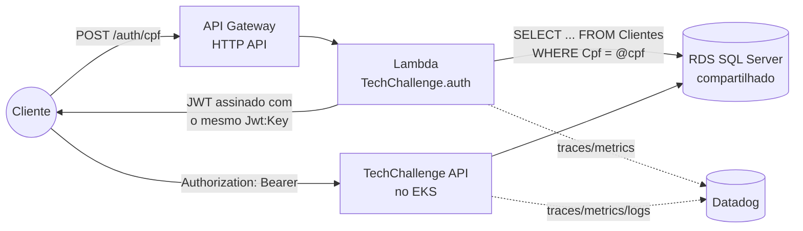
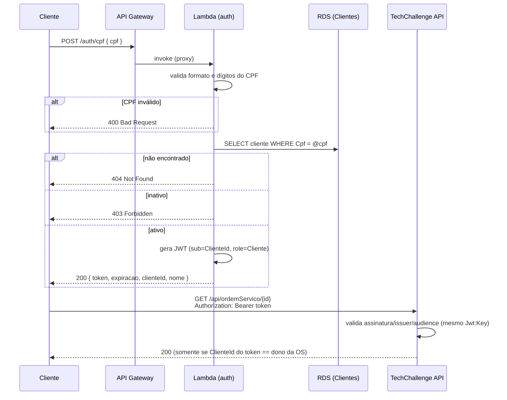

# TechChallenge Auth

## Descrição
Function Serverless (AWS Lambda) responsável pela autenticação de **clientes** da oficina via CPF. Recebe um CPF, valida o formato/dígitos verificadores, consulta a existência e o status (ativo/inativo) do cliente na mesma base de dados usada pela [TechChallenge API](https://github.com/TechChallenge01/TechChallenge), e devolve um token JWT válido para consumo das rotas protegidas daquela API.

Este repositório é um dos quatro que compõem o Tech Challenge:

| Repositório | Papel |
|---|---|
| [TechChallenge](https://github.com/TechChallenge01/TechChallenge) | Aplicação principal (API em Kubernetes) |
| **TechChallenge.auth** (este) | Function Serverless de autenticação por CPF |
| [TechChallenge.db](https://github.com/TechChallenge01/TechChallenge.db) | Infraestrutura do banco de dados gerenciado (Terraform) |
| [TechChallenge.k8s](https://github.com/TechChallenge01/TechChallenge.k8s) | Infraestrutura do cluster Kubernetes (Terraform) |

## Por que este desenho
A TechChallenge API já expõe rotas protegidas por perfil (`Administrador`, `Funcionario`, `Mecanico`, `Almoxarifado`, `Cliente`) validadas com JWT. O que faltava era um jeito do **cliente final** (dono do veículo) se autenticar sem senha — usando apenas o CPF já cadastrado — para consultar e aprovar suas próprias ordens de serviço. Extrair isso para uma function serverless, atrás de um API Gateway, evita subir mais um serviço "sempre ligado" no cluster só para um fluxo de baixíssimo volume/latência tolerante, e é exatamente o padrão pedido pelo desafio (Auth API Gateway + Function Serverless).

O token emitido aqui usa **a mesma chave de assinatura, issuer e audience** (`Jwt:Key` / `Jwt:Issuer` / `Jwt:Audience`) configurados na TechChallenge API — os dois serviços só compartilham um segredo, não código ou banco de escrita. A API principal não precisa saber que o token foi emitido por uma Lambda: ela só valida a assinatura, como já fazia.

## Tecnologias utilizadas
- .NET 8 (ASP.NET Core Minimal APIs)
- `Amazon.Lambda.AspNetCoreServer.Hosting` — permite rodar o mesmo `Program.cs` localmente (Kestrel) e dentro da Lambda (Runtime API), sem duplicar código
- Entity Framework Core (SQL Server) — leitura da tabela `Clientes`
- `System.IdentityModel.Tokens.Jwt` — emissão do JWT
- Datadog (`Datadog.Trace.Bundle` + Lambda Extension) — tracing e métricas serverless
- Docker (imagem de container, runtime `public.ecr.aws/lambda/dotnet:8`)
- Terraform — provisiona o repositório ECR, a função Lambda e o API Gateway (HTTP API)
- GitHub Actions — CI (build + validação do Dockerfile/Terraform) e CD (build/push da imagem + deploy)

## Arquitetura



### Fluxo de autenticação



## Endpoint

**Base URL:** `{API_INVOKE_URL}` (saída `api_invoke_url` do Terraform)

| Método | Rota | Descrição | Status |
|---|---|---|---|
| POST | `/auth/cpf` | Autentica um cliente pelo CPF e devolve um JWT | 200, 400, 403, 404 |
| GET | `/health` | Healthcheck | 200 |

**Request:**
```json
POST /auth/cpf
{
  "cpf": "50872558843"
}
```

**Response (200):**
```json
{
  "token": "eyJhbGciOiJIUzI1NiIsInR5cCI6IkpXVCJ9...",
  "expiracao": "2026-09-02T06:00:00Z",
  "clienteId": "550e8400-e29b-41d4-a716-446655440000",
  "nome": "João da Silva"
}
```

**Erros:**
- `400` — CPF com formato ou dígitos verificadores inválidos
- `404` — nenhum cliente cadastrado com esse CPF
- `403` — cliente encontrado, porém inativo

Com a aplicação rodando localmente, o Swagger fica disponível em `http://localhost:5082/swagger`. Uma collection do Postman pode ser gerada importando esse mesmo `swagger.json`; os exemplos acima cobrem o único endpoint de negócio exposto.

## Como executar localmente

Pré-requisitos: .NET 8 SDK e acesso ao mesmo SQL Server usado pela TechChallenge API (o `docker-compose.yml` daquele repositório sobe um localmente).

```bash
git clone https://github.com/TechChallenge01/TechChallenger.auth.git
cd TechChallenger.auth/TechChallenger.auth

dotnet restore
dotnet run
```

A aplicação sobe em `http://localhost:5082`, com as mesmas configurações de banco/JWT do `appsettings.Development.json`. Ajuste `ConnectionStrings:DefaultConnection` para apontar para o mesmo banco da TechChallenge API — este serviço só faz leitura da tabela `Clientes`, não roda migrations.

### Rodando a imagem de container localmente
```bash
docker build -f TechChallenger.auth/Dockerfile -t techchallenge-auth TechChallenger.auth
docker run --rm -e ConnectionStrings__DefaultConnection="..." -e Jwt__Key="..." -p 9000:8080 techchallenge-auth
```
(imagens baseadas em `public.ecr.aws/lambda/dotnet:8` expõem a Runtime Interface Emulator na porta 8080 — use o [aws-lambda-rie](https://docs.aws.amazon.com/lambda/latest/dg/images-test.html) para invocar localmente como se fosse o Lambda Runtime API.)

## Deploy (Terraform + CI/CD)

A infraestrutura provisionada pelo Terraform em [`terraform/`](terraform):

| Recurso | Arquivo | Descrição |
|---|---|---|
| Repositório ECR | `ecr.tf` | Registry da imagem da Lambda, publicada pela esteira de CD |
| Function Lambda (Image) | `lambda.tf` | Roda a imagem publicada no ECR; variáveis de ambiente (Jwt, connection string, Datadog) |
| API Gateway HTTP API | `apigateway.tf` | Rotas `POST /auth/cpf` e `GET /health`, integração `AWS_PROXY` com a Lambda |
| IAM (LabRole) | `iam.tf` | Reaproveita a role padrão do AWS Academy Learner Lab |

```bash
cd terraform
terraform init
terraform apply \
  -var="db_connection_string=<CONNECTION_STRING_DO_RDS>" \
  -var="jwt_key=<MESMA_CHAVE_DA_TECHCHALLENGE_API>" \
  -var="datadog_api_key=<DATADOG_API_KEY>"
```

O primeiro `apply` cria a função Lambda apontando para a tag `latest` do ECR (que ainda não existe — o primeiro push da esteira de CD resolve isso). Depois desse provisionamento inicial, a esteira **não roda `terraform apply` a cada mudança de código**: ela builda a imagem, dá push no ECR com a tag do commit e chama `aws lambda update-function-code --image-uri`, que é bem mais rápido.

### Pipeline (`.github/workflows/`)
- **`ci.yml`** — Pull Requests para `release`/`main` e push em `release`: build, build da imagem Docker (validação) e `terraform validate`/`fmt`.
- **`cd.yml`** — push em `main`: build → push da imagem para o ECR → `terraform apply` (idempotente, garante que a infra existe) → `aws lambda update-function-code` com a imagem recém-publicada.

Branch `main` protegida (sem commit direto, merge somente via Pull Request).

**Secrets necessários no GitHub (Settings → Secrets and variables → Actions):**

| Secret | Descrição |
|---|---|
| `AWS_ACCESS_KEY_ID`, `AWS_SECRET_ACCESS_KEY`, `AWS_SESSION_TOKEN` | Credenciais temporárias do AWS Academy Learner Lab |
| `RDS_CONNECTION_STRING` | Connection string do mesmo RDS SQL Server usado pela TechChallenge API |
| `JWT_KEY` | **Idêntica** à `Jwt:Key` configurada na TechChallenge API |
| `DATADOG_API_KEY` | API Key do Datadog (opcional — sem ela a extensão simplesmente não instrumenta a função) |

## Observabilidade (Datadog)

A função é instrumentada em duas camadas:
1. **Datadog Lambda Extension** (copiada para a imagem no `Dockerfile`, ativada via `AWS_LAMBDA_EXEC_WRAPPER=/opt/datadog_wrapper`) — coleta métricas de invocação (duração, erros, throttles, cold starts) e encaminha os logs da função para o Datadog sem precisar de um forwarder separado.
2. **`Datadog.Trace.Bundle`** (tracer .NET, referenciado no `.csproj`) — instrumenta automaticamente as chamadas HTTP recebidas e as queries EF Core/SQL Server, permitindo correlacionar o trace de `POST /auth/cpf` com os traces subsequentes na TechChallenge API (mesmo `DD_ENV`/`DD_SERVICE` versionados por unified service tagging).

Todas as variáveis (`DD_API_KEY`, `DD_SITE`, `DD_ENV`, `DD_SERVICE`, variáveis de profiler `CORECLR_*`) são injetadas via `terraform/lambda.tf` — nenhum segredo fica hardcoded na imagem. Ver a seção "Observabilidade / Datadog" do [README da TechChallenge API](https://github.com/TechChallenge01/TechChallenge#observabilidade--datadog) para os dashboards e alertas do lado da API principal.

## Notas importantes
- Este serviço **não escreve** no banco — apenas lê `Id`, `Nome`, `Cpf`, `Email` e `Ativo` da tabela `Clientes`, já criada e migrada pela TechChallenge API.
- O CPF é validado com o mesmo algoritmo de dígito verificador usado no Value Object `Cpf` da TechChallenge API, para manter consistência de regra de negócio entre os dois repositórios.
- Cliente inexistente ou inativo nunca recebe token — o cliente inativo devolve `403` (existe, mas está bloqueado) em vez de `404`, para distinguir os dois casos como pede o desafio ("existência e status").
